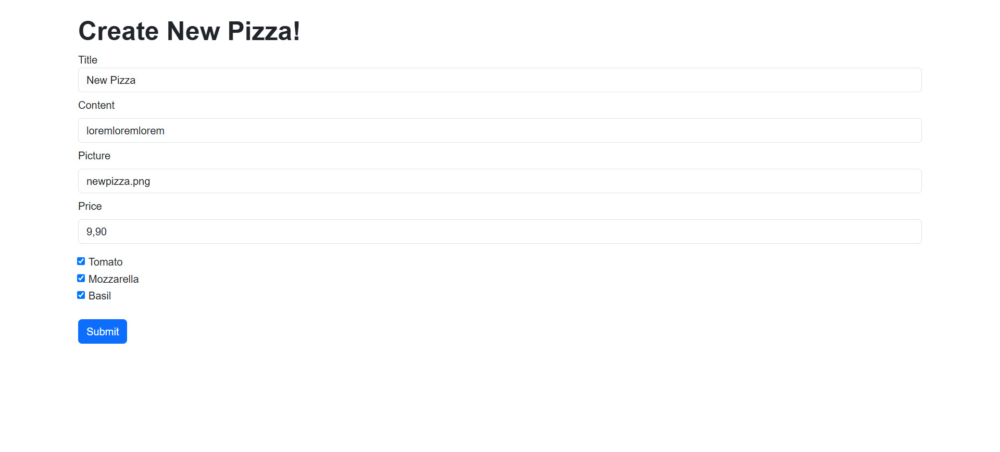
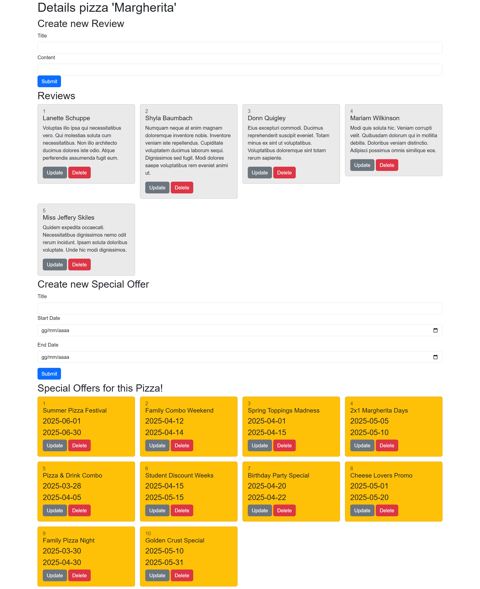
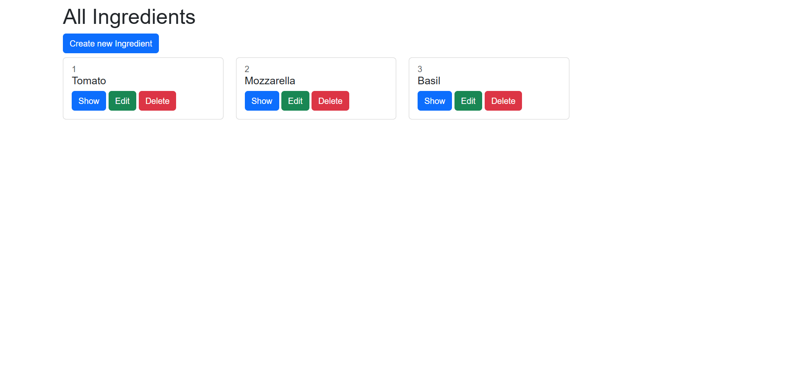
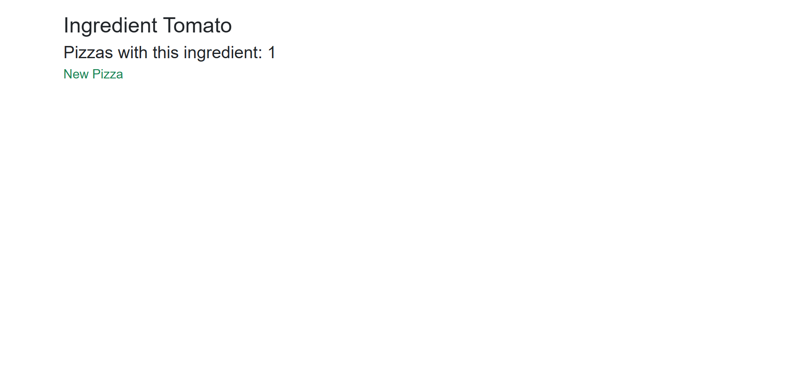

## Spring Pizzeria Web Api
output:

 Project developed... <!--using Java Spring Boot to manage pizzas, ingredients, reviews, and special offers with full CRUD operations. It utilizes Java Beans and JPA Query Methods, including custom optimized queries for advanced filtering based on pizza name, ingredients, and dietary preferences (e.g., gluten-free, vegetarian, halal) through an intuitive form interface. The application supports One-to-Many and Many-to-Many relationships for efficient data management. The user interface is designed with Thymeleaf, leveraging modular fragments for maintainability. Data is pre-populated using seeder classes powered by DataFaker. The project follows the MVC architectural pattern and employs Maven for dependency management 🛰️. -->

